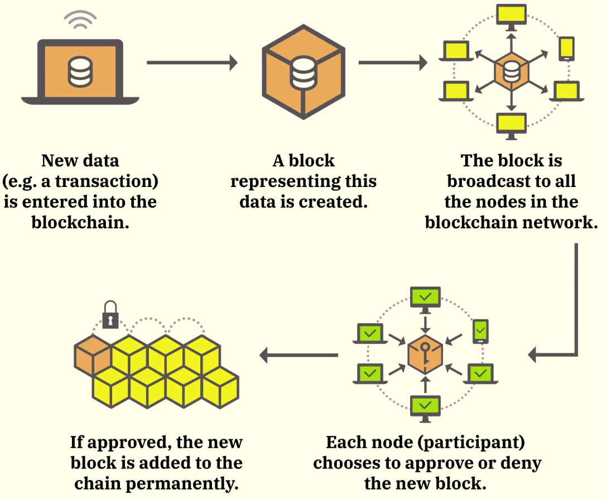
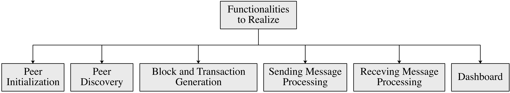
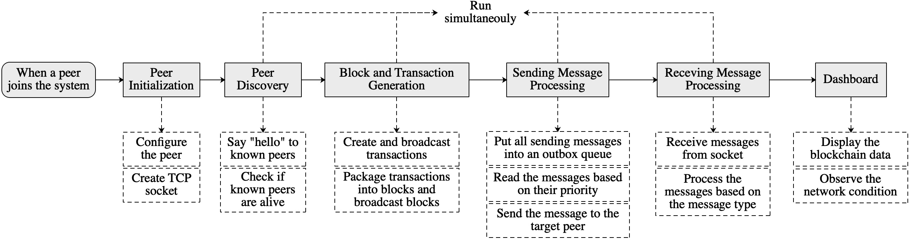

# CS305 2025 Spring Final Project - Blockchain Network Simulation

**We will grade all the projects based on the latest version of this specification. Please read this project specification carefully and keep track of the updates!!!**.

**IMPORTANT NOTE: We try our best to make this specification as clear as possible and cover all the problems we met during our testing. However, it is not uncommon for us to still miss important details in this specification. If anything is unclear, you should submit issues in this repository or contact the instructors and SAs immediately rather than guessing what you must do. Again, if you have any questions, please confirm with the instructors and SAs before starting**.

## 1. Introduction

Bitcoin (BTC) and Ethereum (ETH) are among the most widely known and secure cryptocurrency systems. They allow users to transfer digital coins (e.g., BTC and ETH) without revealing their identities or relying on centralized platforms like banks or Alipay. These capabilities are made possible by **blockchain technology**.

A blockchain is a decentralized ledger that stores an ever-expanding sequence of records, known as **blocks**, which are securely connected through cryptographic hashes. Each block contains a hash of the previous block, a timestamp, and a list of transactions (usually organized as a Merkle tree with the transactions at the leaves). This design forms a chain-like structure, where each block is linked to its predecessor, similar to a linked list. Because each block depends on the integrity of the one before it, altering data retroactively would require modifying all subsequent blocks and achieving **consensus** across the network. This makes blockchain systems highly resistant to tampering and helps prevent issues like double-spending, counterfeiting, fraud, and unauthorized creation of assets.

We take Ethereum as an example. Ethereum is a public blockchain, where any peer can join or leave freely. Entities in the system are called blockchain peers (**peers** later), which can not only generate transactions but also verify transactions generated by other peers and package valid transactions in the form of blocks. These blocks are then verified by all peers in the system and linked to the blockchain if most peers accept them. This process is called **blockchain consensus** (i.e., block generation and verification). Here, each peer stores a copy of the blockchain locally. Thus, a block being linked to the blockchain means that each peer stores the block in their local blockchains. The blockchain consensus ensures that all peers store the same copy of the blockchain.

<em>Figure 1: How a blockchain system operates (nodes = peers).</em>

In each block period (i.e., the interval for generating one block), the basic operation is:

1. Peers generate new transactions and broadcast them to all peers in the system.
2. One peer is selected as a block generator to package transactions as a block.
3. The new block is broadcast to all peers in the system.
4. Peers verify the validity of the block.
5. If most peers accept the block, the block is appended to the blockchain. As such, transactions in the block are stored in the blockchain permanently. A malicious peer intending to modify a block in the blockchain will change all following blocks, which requires all peers to reverify these blocks; this is considered impossible in Bitcoin.

This project focuses on simulating the peer-to-peer (P2P) communication in such a blockchain system. The core functions to simulate include:

- Peer Initialization
- Peer Discovery
- Message Sending/Receiving
- Transaction and Block Generation
- Dashboard Monitoring

The functionalities to be realized are summarized in Figure 2.

<!---
In this project, we will focus on how peers in a blockchain system communicate to exchange data (e.g., transactions and blocks). We can see from Figure 1 that a blockchain system is implemented based on the **peer-to-peer (P2P) network**, in which peers exchange data directly without any centralized entities. This project aims at simulating this blockchain P2P network, which includes the functionality of **peer discovery**, **sending message processing** and **receiving message processing**. Moreover, for exchanging transactions and blocks, a simplified **transaction and block generation** is simulated. Finally, **peer initialization** is necessary before running a peer, and a **dashboard** is used to observe the operation of the network. The functionalities to be realized are summarized in Figure 2.
-->

<em>Figure 2: Functionalities to complete in this project.</em>

-------------------

## 2. Functionality of the Blockchain P2P Network

<em>Figure 3: How different functionalities interact.</em>

Figure 3 shows the relationship between different functionalities. Each core component of the system is described below.

-----

### Part 1: Peer Initialization

Upon joining the network, a peer:
* configures its `IP address`, `port`, and `gossip fanout`, and
* Chooses its role: `normal` or `malicious`, `lightweight` or `full`, `NATed` or `non-NATed`.
* Initializes a TCP socket to receive incoming messages.

**Key Terms:**
* `gossip fanout`: In blockchains, peers usually adopt the gossip protocol while broadcasting blocks and transactions. That is, each peer sends blocks or transactions to a random subset instead of all of its known peers. This can reduce redundant messages in the network. Here, `gossip fanout` indicates the number of target peers while broadcasting blocks and transactions.
* `normal` or `malicious` peer: A normal peer always generates correct transactions and blocks. Instead, a malicious peer can generate incorrect transactions and blocks (e.g., with the wrong block ID).
* `lightweight` or `full` peer: In the introduction, we introduce that all peers verify the block and store a copy of the blockchain, which is called full peers. However, in practice, there are some resource-limited devices (e.g., mobile phones and laptops), which do not have enough computing and storage capacities to verify and store all blocks. To solve this issue, Ethereum allows peers to act as lightweight peers, which do not verify blocks and store all blocks. Instead, lightweight peers store the header of blocks without transactions.
* `NATed` or `non-NATed` peer: This project considers network address translation (NAT). A NATed peer is generally located in a local network and cannot interact directly with peers outside the local network. Instead, non-NATed peers in the local network act as NAT routers or relaying peers between NATed peers and peers outside the local network. Typically, when forwarding external messages to a peer in a local network, a relaying peer must find the destination peer's IP address in the local network based on the NAT translation table. Here, to reduce the complexity, we only simulate the logic of NAT and ignore the NAT translation table; that is, a NATed peer has only one IP address across the network.

-----

### Part 2: Peer Discovery

After creating the TCP socket, the peer informs known peers of its existence in order to exchange data. To do so, a peer must acquire some peers' IP addresses and ports before joining the network. 

Moreover, a peer needs to periodically check if the known peers are alive. 

The procedure of peer discovery is as follows:

* Say `hello` to its known peers while joining the network.
* When receiving a `hello` message, check if the sender is known. If not, add the sender to the list of known peers.
* Periodically send `ping` messages to all known peers and wait for their replies, i.e., `pong` messages.
* When receiving `pong` messages, update the state of known peers. Moreover, calculate the time difference between sending `ping` messages and receiving `pong` messages, which is the transmission latency between peers. 
* Remove unresponsive peers if no `pong` messages are received before the timeout.

------

### Part 3: Block and Transaction Generation and Verification

After initializing a peer and finding the known peers, a full peer starts generating and verifying transactions and blocks. In this project, each full peer periodically generates one transaction and broadcasts it to other full peers for verification. 

A transaction is valid if the transaction ID is correct. These transactions are also stored in the peer's local transaction pool, `tx_pool`. 

Since we only focus on transaction and block exchange in the blockchain P2P network, we simplify block generation here. Instead of selecting a block generator to generate a block, in each block period, each peer packages transactions in their `tx_pool` into a block independently and broadcasts it to other peers for verification. A block is valid if the `block ID` is correct. 

The procedure for transaction/block generation and verification is as follows:

* Synchronize the latest blockchain from known peers while joining the network in order to link new blocks to the latest blockchain.
* Start generating transactions.
* Broadcast the transactions to known peers for verification.
* Add the valid transactions to the local `tx_pool`.
* Package the transactions in the local `tx_pool` into a new block.
* Broadcast the block to known peers for verification.
* Add the valid block to the local blockchain.

**Tips:**
* When a peer sends a block to another, the sender usually sends an `INV` message with the block ID instead of the block itself. If the receiver finds that it has not yet received the block, the receiver will reply with a `GETBLOCK` message to request the block. This can reduce the network overhead.

------

### Part 4: Sending Messages Processing

To simulate the process of sending messages (e.g., transactions and blocks), all sending messages must be put into an outbox queue and sent one by one. The procedure for sending messages is as follows:

* When sending a message, add the message to the outbox queue.
* Read a message from the queue based on their priorities.
* If the message destination is a non-NATed peer, send the message to the destination directly.
* If the message destination is a NATed peer, find the best relaying peer and send the message to the relaying peer.

--------

### Part 5: Receiving Messages Processing

When receiving messages from other peers, the messages must be dispatched and processed based on the message type. The receiving messages processing is as follows:

* Check whether the message sender is banned. Drop the message if the sender is banned.
* Check whether the number of messages sent by the sender is within the limit. Drop the message if the sender sends messages too frequently. This is to prevent denial-of-service (DoS) attacks.
* Check the message type and process the messages accordingly:

  * msg.type=`TX`,
    * Check the validity of the transaction. If invalid, drop the transaction and record the sender's offence.
    * Check whether the transaction has been received. If yes, drop the transaction to prevent replay attacks.
    * Record the count of redundant transactions if they have been received.
    * Add the new transaction to the local `tx_pool` if it has not been received.
    * Broadcast the new transaction to known peers.
      
  * msg.type=`BLOCK`,
    * Check the validity of the block. If invalid, drop the block and record the sender's offence.
    * Check whether the block has been received. If yes, drop the block to prevent replay attacks.
    * Record the count of redundant blocks if they have been received.
    * Add the new block to the list of orphaned blocks if its previous block does not exist in the blockchain due to network delay.
    * Add the new block to the local blockchain if its previous block exists in the blockchain.
    * Check whether the new block is the previous block of the orphaned blocks.
    * Broadcast the new block to known peers.
      
  * msg.type=`INV`,
    * Check whether the block ID in the INV message have been received.
    * Request missing blocks from the message sender.
      
  * msg.type=`GETBLOCK`,
    * Check whether the blocks requested are in the local blockchain. If not, request the blocks from known peers.
    * If the sender is a full peer, reply with the requested blocks.
    * If the sender is a lightweight peer, reply with the header of the requested blocks.
      
  * msg.type=`GET_BLOCK_HEADERS`
    * Reply with the header of blocks in the local blockchain.
      
  * msg.type=`BLOCK_HEADERS`
    * Check the validity of the list of block headers by checking whether the previous block of each block exists in the blockchain.
    * Request the missing block from known peers if the peer is a full peer.

-------

### Part 6: Start Dashboard

Start a dashboard server to display the following message:

* `Localhost: port/peers`: display the set of known peers.
* `Localhost: port/transactions`: display the transactions in the local pool.
* `Localhost: port/blocks`: display the blocks in the local blockchain.
* `Localhost: port/orphan`: display the orphaned blocks.
* `Localhost: port/latency`: display the transmission latency between peers.
* `Localhost: port/capacity`: display the sending capacity of the peers.
* `Localhost: port/redundancy`: display the number of redundant messages received.

-------

## 3. Functions to Complete

The operation logic of the project is given in the `Main` function of `node.py`. Your task is to implement the following modules:

-------

### Part 1: Peer Initialization (`socket_server.py`)

1. `start_socket_server` 

* Create a TCP socket and bind it to the peer’s IP address and port.
* Start listening on the socket for receiving incoming messages.
* When receiving messages, pass the messages to the function `dispatch_message` in `message_handler.py`.

-------

### Part 2: Peer Discovery 

#### `peer_discovery.py`: This part is responsible for saying 'hello' to known peers when the peer joins the system.

1. `start_peer_discovery` 
   
* Define the JSON format of a `hello` message, which should include: `{message type, sender’s ID, IP address, port, flags, and message ID}`. A `sender’s ID` can be `peer_port`. The `flags` should indicate whether the peer is `NATed or non-NATed`, and `full or lightweight`. The `message ID` can be a random number.
* Send a `hello` message to all known peers and put the messages into the outbox queue.
  
2. `handle_hello_message`

* Read information in the received `hello` message.
* If the sender is unknown, add it to the list of known peers (`known_peer`) and record their flags (`peer_flags`).
* Update the set of reachable peers (`reachable_by`).

**Tips:** Each peer can only receive `hello` messages from reachable peers and never forward `hello` messages. If a peer receives `hello` messages from a NATed peer, it can act as the relaying peers of the NATed peer.

#### `peer_manager.py`: This part is responsible for checking the status and recording the performance of known peers.

1. `start_ping_loop`

* Define the JSON format of a `ping` message, which should include `{message type, sender's ID, timestamp}`.

* Send a `ping` message to each known peer periodically.

2. `create_pong`

* Create the JSON format of a `pong` message, which should include `{message type, sender's ID, timestamp in the received ping message}`

3. `handle_pong`

* Read the information in the received `pong` message.

* Update the transmission latenty between the peer and the sender (`rtt_tracker`).

4. `start_peer_monitor`

* Check the latest time to receive `ping` or `pong` message from each peer in `last_ping_time`.

* If the latest time is earlier than the limit, mark the peer's status in `peer_status` as `UNREACHABLE` or otherwise `ALIVE`.

5. `update_peer_heartbeat`

* Update the `last_ping_time` of a peer when receiving its `ping` or `pong` message.

6. `record_offense`

* Record the offence times of a peer when malicious behaviors are detected.

* Add a peer to `blacklist` if its offence times exceed 3.

--------

### Part 3: Block and Transaction Generation and Verification

#### `transaction.py`: This part processes all transaction-related functions.

1. `transaction_generation`

* Randomly choose a peer from `known_peers` and generate a transaction to transfer an arbitrary amount of money to the peer.

* Add the transaction to local `tx_pool` using the function `add_transaction`.

* Broadcast the transaction to `known_peers` using the function `gossip_message` in `outbox.py`.

2. `add_transaction`

* Add a transaction to the local `tx_pool` if it is in the pool.

* Add the transaction ID to `tx_ids`.

3. `get_recent_transaction`

* Return all transactions in the local `tx_pool`.

4. `clear_pool`

* Remove all transactions in `tx_pool` and transaction IDs in `tx_ids`.

#### `block_handler.py`: This part processes all block-related functions.

1. `request_block_sync`

* Define the JSON format of a `GET_BLOCK_HEADERS`, which should include `{message type, sender's ID}`.

* Send a `GET_BLOCK_HEADERS` message to each known peer (to obtain the list of block headers in the latest blockchain) and put the messages in the outbox queue.

2. `block_generation`

* Create a new block periodically using the function `create_dummy_block`.

* Create an `INV` message for the new block using the function `create_inv` in `inv_message.py`.

* Broadcast the `INV` message to known peers using the function `gossip` in `outbox.py`.

3. `create_dummy_block`

* Define the JSON format of a `block`, which should include `{message type, peer's ID, timestamp, block ID, previous block's ID, and transactions}`. The `block ID` is the hash value of the block structure, except for the item `block ID`. `previous block` is the last block in the blockchain, to which the new block will be linked. If the block generator is malicious, it can generate a random block ID.

* Read the transactions in the local `tx_pool` using the function `get_recent_transactions` in `transaction.py` before clearing the local transaction pool.

* Create a new block with the transactions and generate the block ID using the function `compute_block_hash`.
     
* Add the new block into the local blockchain (`receive_block`).

4. `compute_block_hash`

* Compute the hash of a block except for the term `block ID`.

5. `handle_block`

* Check the correctness of `block ID` in the received block. If incorrect, drop the block and record the sender's offence.

* Check if the block exists in the local blockchain. If yes, drop the block.

* Check if the previous block of the block exists in the local blockchain. If not, add the block to the list of orphaned blocks (`orphan_blocks`). If yes, add the block (for full peer) or the block header (for lightweight peer) to the local blockchain.

* Check if the block is the previous block of blocks in `orphan_blocks`. If yes, add the orphaned blocks to the local blockchain.

6. `create_getblock`

* Define the JSON format of a `GETBLOCK` message, which should include `{message type, sender's ID, requesting block IDs}`.

7. `get_block_by_id`

* Return the block in the local blockchain based on the block ID.

#### inv_message.py: This part processes the `INV` message while exchanging blocks.

1. `create_inv`

* Define the JSON format of an `INV` message, which should include `{message type, sender's ID, sending blocks' IDs, message ID}`. Note that `INV` messages are sent before sending blocks. `sending blocks' IDs` is the ID of blocks that the sender wants to send. `message ID` can be a random number generated by `generate_message_id` in `util.py`.

2. `get_inventory`

* Return the block ID of all blocks in the local blockchain.

3. `broadcast_inventory`

* Create an `INV` message with all block IDs in the local blockchain.

* Broadcast the `INV` message to known peers using the function `gossip_message` in `outbox.py` to synchronize the blockchain with known peers.

---------

### Part 4: Sending Message Processing (outbox.py)

1. `enqueue_message`: This function puts all sending messages into an outbox queue.

* Check if the peer sends a message to the receiver too frequently using the function `is_rate_limited`. If yes, drop the message.
  
* Check if the receiver exists in the `blacklist`. If yes, drop the message.
  
* Classify the priority of the sending messages based on the message type using the function `classify_priority`.
  
* Add the message to the queue (`queues`) if the length of the queue is within the limit `QUEUE_LIMIT`, or otherwise, drop the message.

2. `is_rate_limited` 
   
* Check how many messages were sent from the peer to a target peer during the `TIME_WINDOW` that ends now.
  
* If the sending frequency exceeds the sending rate limit `RATE_LIMIT`, return `TRUE`; otherwise, record the current sending time into `peer_send_timestamps`.

3. `classify_priority`
   
*	Classify the priority of a message based on the message type.

4. `send_from_queue` (`outbox.py`)
   
* Read the message in the queue. Each time, read one message with the highest priority of a target peer. After sending the message, read the message of the next target peer. This ensures the fairness of sending messages to different target peers.

* Send the message using the function `relay_or_direct_send`, which will decide whether to send the message to the target peer directly or through a relaying peer.

* Retry a message if it is sent unsuccessfully, and drop the message if the retry times exceed the limit `MAX_RETRIES`.

5. `relay_or_direct_send`

* Check if the target peer is NATed. 

* If the target peer is NATed, use the function `get_relay_peer` to find the best relaying peer. Define the JSON format of a `RELAY` message, which should include `{message type, sender's ID, target peer's ID, `payload`}`. `payload` is the sending message. Send the `RELAY` message to the best relaying peer using the function `send_message`.
  
* If the target peer is non-NATed, send the message to the target peer using the function `send_message`.

6. `get_relay_peer`

* Find the set of relay candidates reachable from the target peer in `reachable_by` of `peer_discovery.py`.
    
* Read the transmission latency between the sender and other peers in `rtt_tracker` in `peer_manager.py`.
  
* Select and return the best relaying peer with the smallest transmission latency.

7. `send_message`

* Send the message to the target peer. Wrap the function `send_message` with the dynamic network condition in the function `apply_network_condition`.

8. `apply_network_conditions`: This function simulates the peer's sending capacity control, message drop, and message transmission latency.

* Use the function `rate_limiter.allow` to check if the peer's sending rate is out of limit. If yes, drop the message and update the drop states (`drop_stats`).

* Generate a random number. If it is smaller than `DROP_PROB`, drop the message to simulate the random message drop in the channel. Update the drop states (`drop_stats`).

* Add a random latency before sending the message to simulate message transmission delay.

* Send the message using the function `send_func`.

9. `start_dynamic_capacity_adjustment`

* Periodically change the peer's sending capacity in `rate_limiter` within the range [2, 10].

10. `gossip_message`

* Read the configuration `fanout` of the peer in `peer_config` of `peer_discovery.py`.

* Randomly select the number of target peers from `known_peers`, which is equal to `fanout`. If the gossip message is a transaction, skip the lightweight peers in the `know_peers`.

* Send the message to the selected target peer and put them in the outbox queue.

11. `get_outbox_status`

* Return the message in the outbox queue.

12. `get_drop_stats`

* Return the drop states (`drop_stats`).

--------

### PART 5: Receiving Message Processing (message_handler.py)

1. `dispatch_message`

* Read the message.

* Check if the message has been seen in `seen_message_ids` to prevent replay attacks. If yes, drop the message and add one to `message_redundancy`. If not, add the message ID to `seen_message_ids`.

* Check if the sender sends messages too frequently using the function `in_bound_limited`. If yes, drop the message.

* Check if the sender exists in the `blacklist` of `peer_manager.py`. If yes, drop the message.

* Process the message according to the message type:

   * msg_type == "RELAY":
        * Check if the peer is the target peer.
        * If yes, extract the payload and recall the function `dispatch_message` to process the payload.
        * If not, forward the message to the target peer using the function `enqueue_message` in `outbox.py`.
    
   * msg_type == "HELLO"
        * Call the function `handle_hello_message` in `peer_discovery.py` to process the message.
    
   * msg_type == "BLOCK"
        * Check the correctness of the block ID. If incorrect, record the sender's offence using the function `record_offence` in `peer_manager.py`.
        * Call the function `handle_block` in `block_handler.py` to process the block.
        * Call the function `create_inv` to create an `INV` message for the block.
        * Broadcast the `INV` message to known peers using the function `gossip_message` in `outbox.py`.
   
   * msg_type == "TX"
        * Check the correctness of the transaction ID. If incorrect, record the sender's offence using the function `record_offence` in `peer_manager.py`.
        * Add the transaction to `tx_pool` using the function `add_transaction` in `transaction.py`.
        * Broadcast the transaction to known peers using the function `gossip_message` in `outbox.py`.
    
   * msg_type == "PING"
        * Update the last ping time using the function `update_peer_heartbeat` in `peer_manager.py`.
        * Create a `pong` message using the function `create_pong` in `peer_manager.py`.
        * Send the `pong` message to the sender using the function `enqueue_message` in `outbox.py`.
    
   * msg_type == "PONG"
        * Update the last ping time using the function `update_peer_heartbeat` in `peer_manager.py`.
        * Call the function `handle_pong` in `peer_manager.py` to handle the message.
 
   * msg_type == "INV"
        * Read all block IDs in the local blockchain using the function `get_inventory` in `block_handler.py`.
        * Compare the local block IDs with those in the message.
        * If there are missing blocks, create a `GETBLOCK` message to request the missing blocks from the sender.
        * Send the `GETBLOCK` message to the sender using the function `enqueue_message` in `outbox.py`.
    
   * msg_type == "GETBLOCK"
        * Extract the block IDs from the message.
        * Get the blocks from the local blockchain according to the block IDs using the function `get_block_by_id` in `block_handler.py`.
        * If the blocks are not in the local blockchain, create a `GETBLOCK` message to request the missing blocks from known peers.
        * Send the `GETBLOCK` message to known peers using the function `enqueue_message` in `outbox.py`.
        * Retry getting the blocks from the local blockchain. If the retry times exceed 3, drop the message.
        * If the blocks exist in the local blockchain, send the blocks one by one to the requester using the function `enqueue_message` in `outbox.py`.
    
   * msg_type == "GET_BLOCK_HEADERS"
        * Read all block headers in the local blockchain and store them in `headers`.
        * Create a `BLOCK_HEADERS` message, which should include `{message type, sender's ID, headers}`.
        * Send the `BLOCK_HEADERS` message to the requester using the function `enqueue_message` in `outbox.py`.
    
   * msg_type == "BLOCK_HEADERS"
        * Check if the previous block of each block exists in the local blockchain or the received block headers.
        * If yes and the peer is lightweight, add the block headers to the local blockchain.
        * If yes and the peer is full, check if there are missing blocks in the local blockchain. If there are missing blocks, create a `GET_BLOCK` message and send it to the sender.
        * If not, drop the message since there are orphaned blocks in the received message and, thus, the message is invalid.
    
2. `is_inbound_limited`

* Record the timestamp when receiving a message from a sender.
* Check if the number of messages sent by the sender exceeds `INBOUND_RATE_LIMIT` during the `INBOUND_TIME_WINDOW`. If yes, return `TRUE`. If not, return `FALSE`.

3. `get_redundancy_stats`

* Return the times of receiving duplicated messages (`message_redundancy`).

---------

### PART 6: Dashboard (dashboard.py)

* `peers`: display the information of known peers, including `{peer's ID, IP address, port, status, NATed or non-NATed, lightweight or full}`.
  
* `transactions`: display the transactions in the local pool `tx_pool`.
  
* `blocks`: display the blocks in the local blockchain.
  
* `orphan`: display the orphaned blocks.
  
* `latency`: display the transmission latency between peers.
  
* `capacity`: display the sending capacity of the peer.
  
* `redundancy`: display the number of redundant messages received.

---------

## 4. Test Method

This project will deploy the blockchain P2P network based on Docker technology, where each peer runs in an independent container. The procedure to run a peer in a container can be summarized as follows:

1) Write a `Dockerfile` to build a container image for a peer. The image can be used to generate multiple containers, i.e., peers.
2) Define the peers in `docker-compose.yml`, including the number of containers, how the containers run, and connect with each other.
3) Use `docker compose build` to build the image for all services in `docker-compose.yml`.
4) Use `docker compose up` to generate and start containers specified in `docker-compose.yml`.

We have provided the `Dockerfile` and `docker-compose.yml` in the starter code with ten peers. With these two files, we will use the following commands to check your project:
1) `docker compose up --build` to check if each peer runs correctly.
2) `localhost:port/{parameter}` to check whether the peers generate and transmit transactions and blocks correctly.

**Bonus:**
1) **Dynamic Blockchain Network**: In the above test method, the number of peers in the blockchain P2P network is fixed. You may add additional functions to your project and modify Docker files to allow peers to dynamically join or leave the system without affecting the operation of other peers. Use different `config.json` for different new peers, so that newly-joined peers may not know all the peers existing in the network.

2) **Causes of Redundant Messages**: Explore the parameters that can affect the number of redundant messages received by a peer, for example, the larger the `fanout` is, the more messages are transmitted to the network and received by a peer. Change the values of the parameters to observe the number of redundant messages received by a peer. Draw figures to show their relationship.

------------

## 5. Grading

**Total Points: 100 pts**

1) Peer Initialization (5 pts)
2) Peer Discovery (10 pts)
3) Block and Transaction Generation and Verification (20 pts)
4) Sending Message Processing (25 pts)
5) Receiving Message Processing (25 pts)
6) Dashboard (5 pts)
7) **A comprehensive report about the implementation details, insights, and improvements is expected. (10 pts)**

 
**Bonus Points: up to 20 pts**
We will grade based on your implementation.

